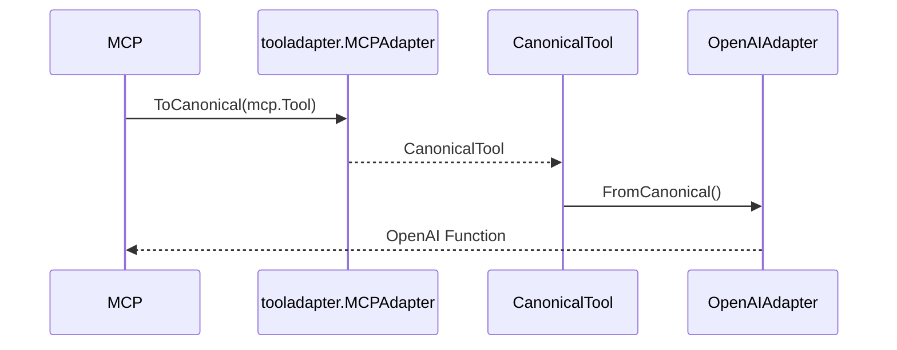

# PRD-001: tooladapter Library Implementation

> **For agents:** REQUIRED SUB-SKILL: Use superpowers:executing-plans to implement this plan task-by-task.

**Goal:** Create a protocol-agnostic tool abstraction library that enables bidirectional conversion between MCP, OpenAI, Anthropic, LangChain (optional), and OpenAPI (import only) tool formats.

**Architecture:** Introduce a canonical tool representation that stores the superset of schema information, enabling lossless conversion between formats. Protocol adapters implement a common interface for bidirectional conversion and feature capability reporting.

**Tech Stack:** Go 1.24+, JSON Schema, MCP Go SDK (for adapter), toolmodel dependency (alignment only)

**Priority:** P1

---

## Context and Stack Alignment

ApertureStack currently uses:
- `toolmodel` for MCP-aligned tool definitions
- `toolindex` for discovery
- `tooldocs` for progressive disclosure
- `toolrun` for execution
- `toolcode`/`toolruntime` for orchestration

`tooladapter` becomes the protocol-agnostic normalization layer that sits alongside (not inside) these libraries. It must not introduce runtime execution, network access, or MCP transport logic. It is a pure data-transform module.

Target MCP semantics align with `toolmodel.MCPVersion` (2025-11-25). All conversion logic must preserve MCP compatibility and avoid UTCP terminology.

---

## Scope

### In scope
- Canonical tool representation (`CanonicalTool`) and full JSON Schema representation (`JSONSchema`).
- Adapter interface and schema feature capability enumeration.
- Adapter registry with conversion helper and feature loss warnings.
- MCP adapter (using `github.com/modelcontextprotocol/go-sdk/mcp`).
- OpenAI adapter (self-contained types; no external SDK dependency).
- Anthropic adapter (self-contained types; no external SDK dependency).
- Schema deep copy + map conversion utilities.
- Unit tests for all exported behavior.
- Minimal README + package doc.

### Out of scope (future)
- LangChain adapter (optional stub only).
- OpenAPI adapter (import only).
- Execution/runtime invocation or transport wiring.
- Persistent storage or caching.

---

## Design Principles

1) **Pure transforms**: no I/O, no network, no runtime execution.
2) **Determinism**: conversions are stable and order-insensitive.
3) **Loss visibility**: feature loss is tracked and reported, not hidden.
4) **Minimal dependencies**: avoid SDK bloat; depend only on MCP SDK + toolmodel.
5) **Go idioms**: error wrapping with `Unwrap()`, thread-safe registry, clear GoDoc.

---

## Directory Structure

```
tooladapter/
├── canonical.go
├── canonical_test.go
├── adapter.go
├── adapter_test.go
├── registry.go
├── registry_test.go
├── adapters/
│   ├── mcp.go
│   ├── mcp_test.go
│   ├── openai.go
│   ├── openai_test.go
│   ├── anthropic.go
│   ├── anthropic_test.go
│   ├── langchain.go        # optional stub
│   └── openapi.go          # optional import-only stub
├── schema/
│   ├── convert.go          # optional
│   ├── convert_test.go
│   ├── validate.go         # optional
│   └── validate_test.go
├── doc.go
├── README.md
├── go.mod
└── go.sum
```

---

## API Shape (Conceptual)

```go
// CanonicalTool represents a protocol-agnostic tool definition.
// ID is namespace:name if Namespace is set, else name.
type CanonicalTool struct {
    Namespace    string
    Name         string
    Version      string
    Description  string
    Category     string
    Tags         []string
    InputSchema  *JSONSchema
    OutputSchema *JSONSchema

    // Execution metadata (no runtime logic here)
    Timeout time.Duration

    // Source tracking
    SourceFormat string
    SourceMeta   map[string]any

    // Access control
    RequiredScopes []string
}

// JSONSchema is a superset representation (2020-12 + draft-07 compatibility).
type JSONSchema struct {
    Type        string
    Properties  map[string]*JSONSchema
    Required    []string
    Items       *JSONSchema
    Description string

    Enum      []any
    Const     any
    Default   any
    Minimum   *float64
    Maximum   *float64
    MinLength *int
    MaxLength *int
    Pattern   string
    Format    string
    Ref       string
    Defs      map[string]*JSONSchema

    AdditionalProperties *bool

    AnyOf []*JSONSchema
    OneOf []*JSONSchema
    AllOf []*JSONSchema
    Not   *JSONSchema
    // Nullable modeled via Type + optional helper field
}

// Adapter converts between protocol-specific and canonical formats.
type Adapter interface {
    Name() string
    ToCanonical(raw any) (*CanonicalTool, error)
    FromCanonical(tool *CanonicalTool) (any, error)
    SupportsFeature(feature SchemaFeature) bool
}

// AdapterRegistry manages adapters and offers conversion with warnings.
type AdapterRegistry interface {
    Register(Adapter) error
    Get(name string) (Adapter, error)
    List() []string
    Unregister(name string) error
    Convert(tool any, fromFormat, toFormat string) (*ConversionResult, error)
}
```

---

## Requirements

### R1 — Canonical representation
- Canonical tool ID is `namespace:name` when namespace is set, else `name`.
- Input schema is required; output schema is optional.
- Schema supports JSON Schema 2020-12 + draft-07 compatibility.
- Deep copy must be fully recursive and not alias slices or maps.

### R2 — Schema semantics and invariants
- `ToMap()` returns a map only with populated fields.
- Schema conversion must preserve:
  - `type`, `properties`, `items`, `required`
  - numeric constraints, enums, pattern, format
  - `$ref`, `$defs`, `additionalProperties`
- Unsupported fields should be omitted (not fabricated).

### R3 — Adapter interface
- `ToCanonical(raw any)` and `FromCanonical(tool *CanonicalTool)`.
- `SupportsFeature(feature SchemaFeature)`.
- Typed errors for conversion failure via `ConversionError`.

### R4 — Adapter registry
- Thread-safe registry with Register/Get/List/Unregister.
- Conversion helper returns feature loss warnings.
- Conversion must wrap errors with adapter + direction context.

### R5 — Protocol adapters
- MCP adapter supports all JSON Schema features.
- OpenAI adapter supports strict mode and reports limited features.
- Anthropic adapter uses `input_schema` and reports unsupported `$ref`.
- Adapters must reject wrong input types with descriptive errors.

### R6 — Error semantics
- All conversion errors must wrap the root cause and be unwrappable.
- Feature loss should not be treated as error (warning only).

### R7 — Concurrency & safety
- Adapter registry operations must be safe under concurrent use.
- Conversion helper must not mutate input tool definitions.

### R8 — Tests
- TDD: failing tests first.
- Coverage target >80% for the module.
- Test both positive and negative paths (invalid input types, missing schema, etc).

---

## Protocol Mapping Details

### MCP adapter
- Uses `github.com/modelcontextprotocol/go-sdk/mcp` types.
- Map MCP tool input schema to JSONSchema and back.
- Preserve annotations in `SourceMeta` (best-effort).

### OpenAI adapter
- Use self-contained struct:
  - `OpenAIFunction{Name, Description, Parameters, Strict}`
- Strict mode:
  - Sets `additionalProperties=false` on output where applicable.
  - Enables pattern validation feature flag.
- `$ref` and `anyOf/oneOf` flagged as unsupported.

### Anthropic adapter
- Use self-contained struct:
  - `AnthropicTool{Name, Description, InputSchema}` with `input_schema`.
- `$ref` unsupported.
- Nullable support should map to `type` adjustments conservatively.

---

## Acceptance Criteria

- CanonicalTool + JSONSchema implemented with DeepCopy and ToMap.
- Adapter interface + SchemaFeature + error/warning types implemented.
- AdapterRegistry implemented with conversion helper.
- MCP/OpenAI/Anthropic adapters implemented and tested.
- All tests pass with >80% coverage.
- Documentation (`doc.go`, README) present and accurate.

---

## Dependencies

- `github.com/modelcontextprotocol/go-sdk/mcp` (MCP adapter)
- `github.com/jonwraymond/toolmodel` (alignment; no runtime coupling)

---

## Versioning, Propagation, and Release Train Integration

### Source of truth
- `ai-tools-stack/go.mod` is the authoritative version matrix for the stack.
- `ai-tools-stack/VERSIONS.md` is auto-generated and synced into each repo.

### Propagation sequence (new module)
1) **Tag `tooladapter`** with `vX.Y.Z` once tests + docs are green.
2) **Update `ai-tools-stack/go.mod`** to include `tooladapter` at the tagged version.
3) **Run** `ai-tools-stack/scripts/update-version-matrix.sh --apply` to regenerate and sync `VERSIONS.md` across repos.
4) **Update docs site** (see Docs section) so `tooladapter` appears in Components + Library Docs.

### DAG order impact
`tooladapter` depends on `toolmodel` (and optionally MCP SDK), so DAG order becomes:

```
toolmodel → tooladapter → toolset → (future: toolskill, toolsemantic, metatools-mcp wiring)
```

This ordering must be respected for release bumps.

### Tagging conventions
- Go module tags: `vX.Y.Z`
- Optional release tags: `tooladapter-vX.Y.Z` (if used elsewhere in the stack)

---

## Integration with metatools-mcp

`tooladapter` does **not** change the MCP surface directly. The integration path is:

1) `toolindex` continues to register `toolmodel.Tool` for MCP-centric tooling.
2) `tooladapter` provides conversion to a canonical representation.
3) `toolset` composes canonical tools and can export MCP/OpenAI/Anthropic formats.
4) `metatools-mcp` can optionally wire `toolset` later to expose filtered subsets.

No server changes are required for this PRD, but the design **must** be compatible
with `metatools-mcp` if a future PRD chooses to expose non-MCP formats.

---

## Documentation, Diagrams, and Publishing

### Repo docs (tooladapter)
Create detailed docs under `tooladapter/docs/`:
- `docs/index.md` — overview + quickstart + design goals
- `docs/design-notes.md` — schema decisions, conversion limitations
- `docs/user-journey.md` — example flow (MCP → canonical → OpenAI)

Include a **Mermaid** sequence diagram in repo docs, e.g.:



### Stack docs (ai-tools-stack)
Add or update:
- `ai-tools-stack/docs/components/tooladapter.md`
- `ai-tools-stack/mkdocs.yml`:
  - Add `tooladapter` under **Components**
  - Add `tooladapter` under **Library Docs (from repos)** with multirepo import
- If needed, update `ai-tools-stack/docs/operations/ci-and-versioning.md` to mention the new module in the version matrix narrative.

**Docs system review (how it works):**
- `ai-tools-stack/mkdocs.yml` uses the **multirepo plugin** to import `docs/` from each repo via `!import`.
- Local preview requires:
  ```bash
  cd ai-tools-stack
  ./scripts/prepare-mkdocs-multirepo.sh
  mkdocs serve
  ```
- Versioned docs are published via **mike**:
  - `latest` tracks `main`
  - tags publish versioned docs and set `stable`

**Docs inventory (where to update):**
- `ai-tools-stack/docs/index.md` — high-level stack landing
- `ai-tools-stack/docs/components/*.md` — per-repo component summaries
- `ai-tools-stack/docs/architecture/overview.md` — stack diagrams (SVG from D2)
- `ai-tools-stack/docs/operations/ci-and-versioning.md` — version matrix + release workflow
- `ai-tools-stack/docs/operations/stack-changelog.md` — generated from `ai-tools-stack/go.mod`

### D2 component diagram
Create `ai-tools-stack/docs/diagrams/component-tooladapter.d2` and render to SVG:

```bash
cd ai-tools-stack
./scripts/render-d2.sh
```

Reference the SVG in `ai-tools-stack/docs/components/tooladapter.md` and, if needed,
in `docs/architecture/overview.md`.

### Publishing flow (GitHub Pages + MkDocs)
- MkDocs site builds via `ai-tools-stack` CI with multirepo plugin.
- Docs from `tooladapter/docs/` are pulled automatically by `!import` entries.
- Versioned docs are published with `mike`; `latest` tracks `main` and tags publish stable versions.

---

## Quality Gates

- `go test ./...`
- `go vet ./...`
- `golangci-lint run` (if configured)
- `gosec ./...` (if configured)

Never claim checks passed unless actually run.

---

## Release & Versioning

- Use semver tags (`vX.Y.Z`) for module releases.
- Add `VERSIONS.md` once aligned with `ai-tools-stack` version matrix.
- After tagging, update `ai-tools-stack/go.mod` + `ai-tools-stack/VERSIONS.md`.

---

## Notes

- Keep JSON Schema conversion conservative; do not invent unsupported fields.
- Avoid UTCP terminology. MCP terminology only.
- All exported APIs must have GoDoc comments.
