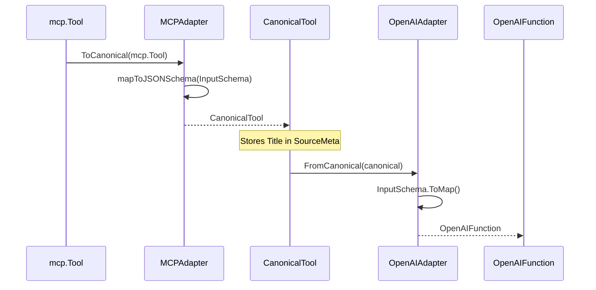

# User Journey: MCP to OpenAI Conversion

This document walks through a complete conversion from MCP tool format to OpenAI function format.

## Scenario

You have an MCP server with a `get_weather` tool and want to expose it to an OpenAI-compatible client.

## Step 1: Define the MCP Tool

```go
mcpTool := mcp.Tool{
    Name:        "get_weather",
    Title:       "Get Weather",
    Description: "Get current weather for a location",
    InputSchema: map[string]any{
        "type": "object",
        "properties": map[string]any{
            "location": map[string]any{
                "type":        "string",
                "description": "City name or coordinates",
            },
            "units": map[string]any{
                "type":    "string",
                "enum":    []any{"celsius", "fahrenheit"},
                "default": "celsius",
            },
        },
        "required": []any{"location"},
    },
}
```

## Step 2: Set Up Registry

```go
registry := tooladapter.NewRegistry()
registry.Register(adapters.NewMCPAdapter())
registry.Register(adapters.NewOpenAIAdapter())
```

## Step 3: Convert to OpenAI Format

```go
result, err := registry.Convert(mcpTool, "mcp", "openai")
if err != nil {
    log.Fatal(err)
}

openaiFunc := result.Tool.(adapters.OpenAIFunction)
```

## Conversion Flow



## Step 4: Check for Warnings

```go
for _, w := range result.Warnings {
    log.Printf("Warning: %s", w)
}
```

If the MCP tool used `$ref` or `$defs`, you'd see warnings here since OpenAI doesn't support them.

## Step 5: Use the OpenAI Function

```go
// The OpenAI function is ready to use
fmt.Printf("Function name: %s\n", openaiFunc.Name)
fmt.Printf("Description: %s\n", openaiFunc.Description)

// Serialize to JSON for API calls
data, _ := json.Marshal(openaiFunc)
fmt.Println(string(data))
```

Output:
```json
{
    "name": "get_weather",
    "description": "Get current weather for a location",
    "parameters": {
        "type": "object",
        "properties": {
            "location": {
                "type": "string",
                "description": "City name or coordinates"
            },
            "units": {
                "type": "string",
                "enum": ["celsius", "fahrenheit"],
                "default": "celsius"
            }
        },
        "required": ["location"]
    }
}
```

## Handling Strict Mode

For OpenAI strict mode, set `strict: true` in SourceMeta before converting back:

```go
canonical.SourceMeta["strict"] = true
result, _ := registry.Get("openai").FromCanonical(canonical)
openaiFunc := result.(adapters.OpenAIFunction)
// openaiFunc.Strict == true
// openaiFunc.Parameters["additionalProperties"] == false
```

## Complete Example

See the [Quick Start](index.md#quick-start) for a complete working example.
