# User Journey: Tool Format Conversion

This document walks through complete conversion examples between MCP, OpenAI, and Anthropic tool formats.

## Journey 1: MCP to OpenAI Conversion

### Scenario

You have an MCP server with a `get_weather` tool and want to expose it to an OpenAI-compatible client (e.g., for use with GPT-4).

### Step 1: Define the MCP Tool

```go
import "github.com/modelcontextprotocol/go-sdk/mcp"

mcpTool := mcp.Tool{
    Name:        "get_weather",
    Title:       "Get Weather",
    Description: "Get current weather for a location",
    InputSchema: map[string]any{
        "type": "object",
        "properties": map[string]any{
            "location": map[string]any{
                "type":        "string",
                "description": "City name or coordinates",
            },
            "units": map[string]any{
                "type":    "string",
                "enum":    []any{"celsius", "fahrenheit"},
                "default": "celsius",
            },
        },
        "required": []any{"location"},
    },
}
```

### Step 2: Set Up the Registry

```go
import (
    "github.com/jonwraymond/tooladapter"
    "github.com/jonwraymond/tooladapter/adapters"
)

registry := tooladapter.NewRegistry()
registry.Register(adapters.NewMCPAdapter())
registry.Register(adapters.NewOpenAIAdapter())
registry.Register(adapters.NewAnthropicAdapter())
```

### Step 3: Convert to OpenAI Format

```go
result, err := registry.Convert(mcpTool, "mcp", "openai")
if err != nil {
    log.Fatal(err)
}

openaiFunc := result.Tool.(adapters.OpenAIFunction)
```

### Conversion Flow Diagram

```mermaid
%%{init: {'theme': 'base', 'themeVariables': {'actorBkg': '#2b6cb0', 'actorTextColor': '#fff', 'actorBorder': '#2c5282'}}}%%
sequenceDiagram
    autonumber

    participant Client as 🖥️ Client
    participant Registry as 📋 AdapterRegistry
    participant MCP as 📡 MCPAdapter
    participant Canon as 🎯 CanonicalTool
    participant OpenAI as 🤖 OpenAIAdapter
    participant Result as 📦 OpenAIFunction

    rect rgb(43, 108, 176, 0.1)
        Note over Client,Canon: Phase 1: Convert to Canonical
        Client->>+Registry: Convert(mcpTool, "mcp", "openai")
        Registry->>+MCP: ToCanonical(mcp.Tool)
        MCP->>MCP: mapToJSONSchema(InputSchema)
        MCP->>Canon: Create CanonicalTool
        Note over Canon: Name: "get_weather"<br/>Description: "Get current weather..."<br/>SourceMeta["title"] = "Get Weather"
    end

    rect rgb(214, 158, 46, 0.1)
        Note over Registry,OpenAI: Phase 2: Check Feature Loss
        Registry->>OpenAI: SupportsFeature(each feature)
        Note over Registry: Collect warnings for<br/>unsupported features
    end

    rect rgb(56, 161, 105, 0.1)
        Note over OpenAI,Result: Phase 3: Convert to Target
        Registry->>+OpenAI: FromCanonical(canonical)
        OpenAI->>OpenAI: InputSchema.ToMap()
        OpenAI->>Result: Create OpenAIFunction
        Result-->>-OpenAI: OpenAIFunction
        OpenAI-->>-Registry: tool
        Registry-->>-Client: ConversionResult{Tool, Warnings}
    end
```

### Format Conversion Architecture

```mermaid
%%{init: {'theme': 'base', 'themeVariables': {'primaryColor': '#d69e2e'}}}%%
flowchart LR
    subgraph sources["Source Formats"]
        MCP_IN["📡 MCP Tool"]
        OPENAI_IN["🤖 OpenAI Function"]
        ANTHROPIC_IN["🔷 Anthropic Tool"]
    end

    subgraph canonical["Canonical Form"]
        Canon["🎯 CanonicalTool<br/><small>• Name, Description<br/>• InputSchema (JSONSchema)<br/>• SourceFormat, SourceMeta</small>"]
    end

    subgraph targets["Target Formats"]
        MCP_OUT["📡 MCP Tool"]
        OPENAI_OUT["🤖 OpenAI Function"]
        ANTHROPIC_OUT["🔷 Anthropic Tool"]
    end

    MCP_IN --> Canon
    OPENAI_IN --> Canon
    ANTHROPIC_IN --> Canon

    Canon --> MCP_OUT
    Canon --> OPENAI_OUT
    Canon --> ANTHROPIC_OUT

    style canonical fill:#d69e2e,stroke:#b7791f,stroke-width:3px
    style sources fill:#3182ce,stroke:#2c5282
    style targets fill:#38a169,stroke:#276749
```



### Step 4: Check for Feature Loss Warnings

```go
for _, w := range result.Warnings {
    log.Printf("Warning: %s", w)
}
```

If the MCP tool used `$ref`, `$defs`, or combinators, you would see warnings like:

```
Warning: feature $ref lost converting from mcp to openai
Warning: feature anyOf lost converting from mcp to openai
```

### Step 5: Use the OpenAI Function

```go
import "encoding/json"

fmt.Printf("Function name: %s\n", openaiFunc.Name)
fmt.Printf("Description: %s\n", openaiFunc.Description)

// Serialize to JSON for OpenAI API
data, _ := json.MarshalIndent(openaiFunc, "", "  ")
fmt.Println(string(data))
```

**Output:**

```json
{
  "name": "get_weather",
  "description": "Get current weather for a location",
  "parameters": {
    "type": "object",
    "properties": {
      "location": {
        "type": "string",
        "description": "City name or coordinates"
      },
      "units": {
        "type": "string",
        "enum": ["celsius", "fahrenheit"],
        "default": "celsius"
      }
    },
    "required": ["location"]
  }
}
```

---

## Journey 2: OpenAI to Anthropic Conversion

### Scenario

You have OpenAI function definitions and want to use them with Claude.

### Step 1: Define the OpenAI Function

```go
openaiFunc := adapters.OpenAIFunction{
    Name:        "search_documents",
    Description: "Search documents by query",
    Parameters: map[string]any{
        "type": "object",
        "properties": map[string]any{
            "query": map[string]any{
                "type":        "string",
                "description": "Search query",
            },
            "limit": map[string]any{
                "type":    "integer",
                "minimum": 1,
                "maximum": 100,
                "default": 10,
            },
        },
        "required": []any{"query"},
    },
    Strict: true,
}
```

### Step 2: Convert to Anthropic Format

```go
result, err := registry.Convert(openaiFunc, "openai", "anthropic")
if err != nil {
    log.Fatal(err)
}

anthropicTool := result.Tool.(adapters.AnthropicTool)
```

### Step 3: Serialize for Claude API

```go
data, _ := json.MarshalIndent(anthropicTool, "", "  ")
fmt.Println(string(data))
```

**Output:**

```json
{
  "name": "search_documents",
  "description": "Search documents by query",
  "input_schema": {
    "type": "object",
    "properties": {
      "query": {
        "type": "string",
        "description": "Search query"
      },
      "limit": {
        "type": "integer",
        "minimum": 1,
        "maximum": 100,
        "default": 10
      }
    },
    "required": ["query"]
  }
}
```

Note that Anthropic uses `input_schema` while OpenAI uses `parameters`.

---

## Journey 3: Handling Feature Loss

### Scenario

Converting an MCP tool that uses advanced JSON Schema features to OpenAI format.

### Step 1: Define MCP Tool with $ref

```go
mcpTool := mcp.Tool{
    Name:        "create_user",
    Description: "Create a new user",
    InputSchema: map[string]any{
        "type": "object",
        "properties": map[string]any{
            "user": map[string]any{
                "$ref": "#/$defs/User",
            },
        },
        "$defs": map[string]any{
            "User": map[string]any{
                "type": "object",
                "properties": map[string]any{
                    "name":  map[string]any{"type": "string"},
                    "email": map[string]any{"type": "string", "format": "email"},
                },
                "required": []any{"name", "email"},
            },
        },
        "required": []any{"user"},
    },
}
```

### Step 2: Convert and Inspect Warnings

```go
result, err := registry.Convert(mcpTool, "mcp", "openai")
if err != nil {
    log.Fatal(err)
}

fmt.Printf("Conversion completed with %d warnings:\n", len(result.Warnings))
for _, w := range result.Warnings {
    fmt.Printf("  - %s\n", w)
}
```

**Output:**

```
Conversion completed with 2 warnings:
  - feature $ref lost converting from mcp to openai
  - feature $defs lost converting from mcp to openai
```

### What Happens to the Schema

The `$ref` and `$defs` are present in the canonical representation but will be **omitted** from the OpenAI output since OpenAI doesn't support them. The resulting OpenAI function will have an incomplete schema.

**Recommendation:** When using advanced JSON Schema features, either:

1. Expand `$ref` references before conversion
2. Use a target format that supports the features (MCP or Anthropic for combinators)
3. Accept the feature loss and document it

---

## Journey 4: OpenAI Strict Mode

### Scenario

Enable OpenAI's strict mode for more reliable function calling.

### Step 1: Set Strict Mode via SourceMeta

```go
// Convert MCP to Canonical first
mcpAdapter := adapters.NewMCPAdapter()
canonical, _ := mcpAdapter.ToCanonical(mcpTool)

// Enable strict mode
canonical.SourceMeta["strict"] = true

// Convert to OpenAI
openaiAdapter := adapters.NewOpenAIAdapter()
result, _ := openaiAdapter.FromCanonical(canonical)

openaiFunc := result.(adapters.OpenAIFunction)
```

### Step 2: Verify Strict Mode Applied

```go
fmt.Printf("Strict mode: %v\n", openaiFunc.Strict)

// Check additionalProperties is set to false
data, _ := json.MarshalIndent(openaiFunc, "", "  ")
fmt.Println(string(data))
```

**Output:**

```json
{
  "name": "get_weather",
  "description": "Get current weather for a location",
  "parameters": {
    "type": "object",
    "properties": {
      "location": { "type": "string" }
    },
    "required": ["location"],
    "additionalProperties": false
  },
  "strict": true
}
```

---

## Journey 5: Bulk Conversion

### Scenario

Convert multiple tools from one format to another.

### Implementation

```go
func ConvertTools(
    registry *tooladapter.AdapterRegistry,
    tools []mcp.Tool,
    targetFormat string,
) ([]any, []tooladapter.FeatureLossWarning) {
    var converted []any
    var allWarnings []tooladapter.FeatureLossWarning

    for _, tool := range tools {
        result, err := registry.Convert(tool, "mcp", targetFormat)
        if err != nil {
            log.Printf("Failed to convert %s: %v", tool.Name, err)
            continue
        }
        converted = append(converted, result.Tool)
        allWarnings = append(allWarnings, result.Warnings...)
    }

    return converted, allWarnings
}
```

### Usage

```go
mcpTools := []mcp.Tool{tool1, tool2, tool3}
openaiTools, warnings := ConvertTools(registry, mcpTools, "openai")

fmt.Printf("Converted %d tools with %d total warnings\n",
    len(openaiTools), len(warnings))
```

---

## Summary

| Journey | From | To | Key Points |
|---------|------|-----|------------|
| 1 | MCP | OpenAI | Basic conversion, Title in SourceMeta |
| 2 | OpenAI | Anthropic | Field name differences (parameters vs input_schema) |
| 3 | MCP | OpenAI | Feature loss warnings for $ref/$defs |
| 4 | MCP | OpenAI | Strict mode via SourceMeta |
| 5 | MCP | Any | Bulk conversion pattern |

For more details on schema decisions and limitations, see [Design Notes](design-notes.md).
